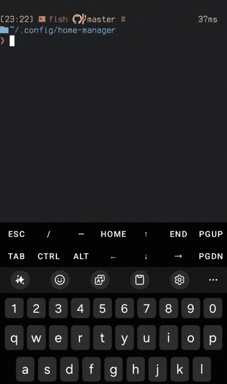

# Hodur [](https://github.com/sindresorhus/awesome)

[](https://opensource.org/licenses/MIT)

**Hodur.nvim** is a plugin for [Neovim](https://github.com/neovim/neovim) that allows you to quickly open a file or copy URL located under the cursor.



## Contents
- [Features](#features)
- [Installation](#installation)
- [Terminal integration](#terminal-integration)

## Features

- Jump to the file under cursor.
  - Supports formats: `file`, `file:line`, `file:line:column`.
  - Automatically positions the cursor at the correct location.
  - Highlight target line
- Terminal integration.
  - `Hodur` can take the current working directory of an `nvim` terminal into account. See [Terminal integration](#terminal-integration) for setup instructions
- Copy URL under cursor to the clipboard.
  - Support for `http(s)://` and `ftp://` URLs
  - Highlight copied text
- Configurable hotkey (default is **Ctrl+G)**.

## Installation

#### Using [packer.nvim](https://github.com/wbthomason/packer.nvim)
``` lua
use {
    'vodchella/hodur.nvim',
    config = function()
        require('hodur').setup({
            key = "<C-g>"
        })
    end
}
```

## Terminal integration

When working in an `nvim` terminal, you often need to open a file directly from there (as shown in the video above). However, there is one problem: the current working directory of `nvim` itself (or the current buffer's `:pwd`) may differ from the terminal's current working directory. In that case, opening a file using a relative or incomplete path becomes impossible.

Fortunately, modern shells can emit special escape sequences whenever the working directory changes, and `Hodur` is able to intercept and process them, solving this problem automatically.

Configure your shell once, and the magic will just work. :)

- **Fish**. Create a file named `~/.config/fish/functions/__update_cwd.fish` with the following contents:
```fish
function __update_cwd --on-variable PWD
    printf '\e]7;file://%s%s\e\\' $hostname $PWD
end
```

- **Bash**. Add the following to `~/.bashrc`:
```bash
__update_cwd() {
    local host
    host="$(hostname)"
    local dir="${PWD// /%20}"
    printf '\e]7;file://%s%s\e\\' "$host" "$dir"
}
PROMPT_COMMAND="__update_cwd${PROMPT_COMMAND:+;$PROMPT_COMMAND}"
```

- **Zsh**. Add the following to `~/.zshrc`:
```zsh
__update_cwd() {
    local dir="${PWD// /%20}"

    printf '\e]7;file://%s%s\e\\' "$HOST" "$dir"
}
autoload -Uz add-zsh-hook
add-zsh-hook chpwd __update_cwd
add-zsh-hook precmd __update_cwd
```

Afterwards, don't forget to reload your shell configuration (or simply restart your shell).
