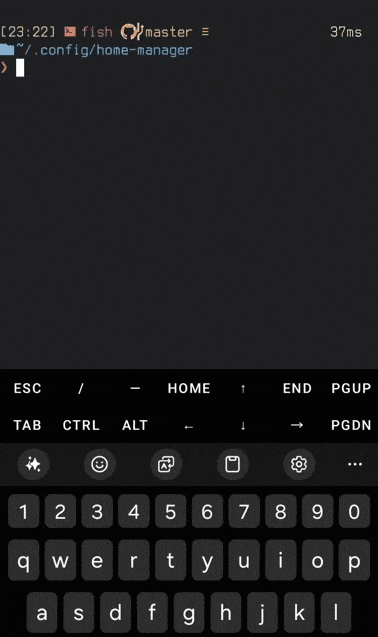

# Hodur.nvim

[](https://opensource.org/licenses/MIT)

**Hodur.nvim** is a plugin for [Neovim](https://github.com/neovim/neovim) that allows you to quickly open a file or copy URL located under the cursor.



## Features

- Jump to the file under cursor.
  - Supports formats: `file`, `file:line`, `file:line:column`.
  - Automatically positions the cursor at the correct location.
  - Highlight target line
- Copy URL under cursor to the clipboard:
  - Support for `http(s)://` and `ftp://` URLs
  - Highlight copied text
- Configurable hotkey (default is **Ctrl+G)**.

## Installation

#### Using [packer.nvim](https://github.com/wbthomason/packer.nvim)
``` lua
use {
    'vodchella/hodur.nvim',
    config = function()
        require('hodur').setup({
            key = "<C-g>"
        })
    end
}
```
